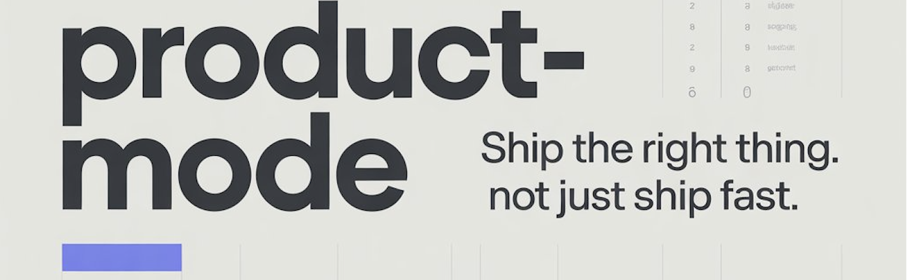

# product-mode



**A CLAUDE.md for product teams who ship the right thing- not just ship fast.**

The PM-team counterpart to [andrej-karpathy-skills](https://github.com/forrestchang/andrej-karpathy-skills). Credit to [@karpathy](https://x.com/karpathy) for naming the failure modes that inspired this work.

---

## The Two Problems

Karpathy named the problem for engineers working with LLMs:

> "The models make wrong assumptions on your behalf and just run along with them... They don't manage their confusion, don't seek clarifications, don't surface inconsistencies, don't present tradeoffs, don't push back when they should."

His CLAUDE.md fixes this for solo engineers. It's excellent.

But there's a failure mode it doesn't touch, the one that kills product teams:

> **Shipping the wrong thing, well.**

A beautifully implemented feature for a problem that doesn't matter is still waste. And in mixed PM + engineering teams working with Claude Code, that's the more expensive mistake.

**product-mode** adds the missing layer: problem framing, scope discipline, tradeoff articulation, outcome measurement, and decision logging- applied *before* the code gets written.

---

## The Seven Principles

| # | Principle | What it prevents |
|---|---|---|
| 1 | **Frame the Problem Before the Solution** | Building for the wrong user |
| 2 | **Make Assumptions & Unknowns Visible** | Silent guessing |
| 3 | **Ship the Minimum Viable Change** | Scope creep, gold-plating |
| 4 | **Name the Tradeoffs** | Invisible costs, political decisions |
| 5 | **Define Done by Outcome, Not Output** | "Merged" mistaken for "done" |
| 6 | **Instrument Before You Ship** | Shipping blind |
| 7 | **Log the Decision, Flag Reversibility** | Repeating mistakes, calcifying defaults |

Plus a **pre-flight checklist** (5 questions before any non-trivial change) and a **when-to-skip-this-rigor** table: because not every typo needs a decision log.

Full file: [`CLAUDE.md`](./CLAUDE.md)

---

## Install

**New project:**

```bash
curl -o CLAUDE.md https://raw.githubusercontent.com/sohaibt/product-mode/main/CLAUDE.md
```

**Existing CLAUDE.md (append):**

```bash
echo "" >> CLAUDE.md
curl https://raw.githubusercontent.com/sohaibt/product-mode/main/CLAUDE.md >> CLAUDE.md
```

---

## Who This Is For

- **PMs who vibe-code** with Claude Code, Cursor, or Lovable and want their AI to think like a product partner
- **Engineering teams** working alongside product, tired of re-shipping because the problem was wrong
- **Solo founders** building SaaS who want guardrails against their own scope creep

If you're shipping with AI and your bottleneck is *what to build*, not *how to build it*  this is for you.

---

## Why This Exists

I've spent 20+ years in product leadership (Booking.com, Foodics, Eneco, Tamatem Games). I am now building products, one specifically to help solve the problem of not building the right thing (not announced yet) and write about Product Management and AI-assisted product building at [Mastering Product HQ](https://masteringproducthq.substack.com).

Every week I see the same pattern: teams using Claude Code to ship faster- and shipping the wrong thing faster. Karpathy nailed the engineering half. This file tries to nail the product half.

---

## Customization

These principles are meant to be merged with your project's own CLAUDE.md. Add project-specific context below the seven principles:

```markdown
## Project-Specific Context

- Our primary user is [X]
- Success metric for this quarter is [Y]
- We intentionally avoid [Z]
```

---

## Tradeoff Note

These guidelines bias toward **rigor over speed**. For trivial changes (typos, obvious fixes), use judgment- the file includes a *when to skip this rigor* table at the end.

---

## License

MIT. Fork, adapt, make it your team's own. If it helps, a star is appreciated.

---

*Inspired by [andrej-karpathy-skills](https://github.com/forrestchang/andrej-karpathy-skills) and [Andrej Karpathy's observations](https://x.com/karpathy/status/2015883857489522876) on LLM coding pitfalls.*
