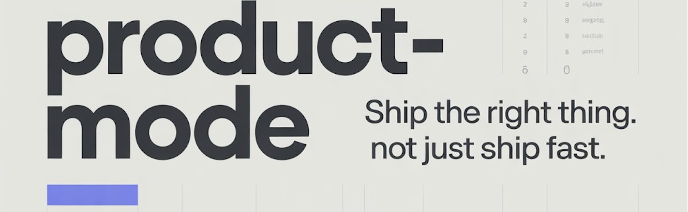

# product-mode



**A CLAUDE.md for product teams who ship the right thing- not just ship fast.**

The PM-team counterpart to [andrej-karpathy-skills](https://github.com/forrestchang/andrej-karpathy-skills). Credit to [@karpathy](https://x.com/karpathy) for naming the failure modes that inspired this work.

---

## The Two Problems

Karpathy named the problem for engineers working with LLMs:

> "The models make wrong assumptions on your behalf and just run along with them... They don't manage their confusion, don't seek clarifications, don't surface inconsistencies, don't present tradeoffs, don't push back when they should."

His CLAUDE.md fixes this for solo engineers. It's excellent.

But there's a failure mode it doesn't touch, the one that kills product teams:

> **Shipping the wrong thing, well.**

A beautifully implemented feature for a problem that doesn't matter is still waste. And in mixed PM + engineering teams working with Claude Code, that's the more expensive mistake.

**product-mode** adds the missing layer: problem framing, scope discipline, tradeoff articulation, outcome measurement, and decision logging- applied *before* the code gets written.

---

## The Seven Principles

| # | Principle | What it prevents |
|---|---|---|
| 1 | **Frame the Problem Before the Solution** | Building for the wrong user |
| 2 | **Make Assumptions & Unknowns Visible** | Silent guessing |
| 3 | **Ship the Minimum Viable Change** | Scope creep, gold-plating |
| 4 | **Name the Tradeoffs** | Invisible costs, political decisions |
| 5 | **Define Done by Outcome, Not Output** | "Merged" mistaken for "done" |
| 6 | **Instrument Before You Ship** | Shipping blind |
| 7 | **Log the Decision, Flag Reversibility** | Repeating mistakes, calcifying defaults |

Plus a **pre-flight checklist** (5 questions before any non-trivial change) and a **when-to-skip-this-rigor** table: because not every typo needs a decision log.

Full file: [`CLAUDE.md`](./CLAUDE.md). Same file, other name: [`AGENTS.md`](./AGENTS.md).

---

## 🚀 NEW: product-mode CLI Tool

In addition to the documentation, product-mode now includes a CLI tool to help you apply the principles in practice!

### Installation

```bash
# From the product-mode directory
npm install

# Or install globally
npm install -g .
```

### Usage

#### Pre-flight Checklist
Run before starting any non-trivial work:

```bash
product-mode checklist
# Or with work description
product-mode checklist "Add user profile feature"
```

This will prompt you through the 5-question pre-flight checklist and save your answers to `.product-mode/checklist/`.

#### Decision Logging
Log important decisions following Principle #7:

```bash
product-mode decision
# Or with title
product-mode decision "Choose database technology"
```

Creates a structured decision log in `.product-mode/decisions/`.

#### Trivial Change Detection
Check if your changes are trivial (can skip full rigor):

```bash
product-mode trivial
# Or check specific files
product-mode trivial src/app.js src/utils.js
```

Uses heuristics to detect typos, comment changes, and other trivial modifications.

### Example Workflow

```bash
# 1. Think about starting work
product-mode checklist "Implement dark mode toggle"
# → Answers questions and saves checklist

# 2. Do the work
# ... write code ...

# 3. Check if changes are trivial before committing
product-mode trivial
# → If non-trivial, consider running checklist again
# → If trivial, you can proceed with lighter rigor

# 4. Log important decisions
product-mode decision "Dark mode implementation approach"
# → Logs your choice of CSS variables vs separate stylesheet, etc.
```

---

## Install

**New project:**

```bash
curl -o CLAUDE.md https://raw.githubusercontent.com/sohaibt/product-mode/main/CLAUDE.md
```

**Existing CLAUDE.md (append):**

```bash
echo "" >> CLAUDE.md
curl https://raw.githubusercontent.com/sohaibt/product-mode/main/CLAUDE.md >> CLAUDE.md
```

**Cursor, Codex, Copilot, Gemini CLI, or any tool that reads [AGENTS.md](https://agents.md):**

```bash
curl -o AGENTS.md https://raw.githubusercontent.com/sohaibt/product-mode/main/AGENTS.md
```

**For the CLI tool:**

```bash
# Clone and install
git clone https://github.com/sohaibt/product-mode
cd product-mode
npm install
npm link  # or npm install -g .
```

---

## Who This Is For

- **PMs who vibe-code** with Claude Code, Cursor, or Lovable and want their AI to think like a product partner
- **Engineering teams** working alongside product, tired of re-shipping because the problem was wrong
- **Solo founders** building SaaS who want guardrails against their own scope creep

If you're shipping with AI and your bottleneck is *what to build*, not *how to build it*  this is for you.

---

## Why This Exists

I've spent 20+ years in product leadership (Booking.com, Foodics, Eneco, Tamatem Games). I am now building products, one specifically to help solve the problem of not building the right thing (not announced yet) and write about Product Management and AI-assisted product building at [Mastering Product HQ](https://masteringproducthq.substack.com).

Every week I see the same pattern: teams using Claude Code to ship faster- and shipping the wrong thing faster. Karpathy nailed the engineering half. This file tries to nail the product half.

---

## Customization

These principles are meant to be merged with your project's own CLAUDE.md. Add project-specific context below the seven principles:

```markdown
## Project-Specific Context

- Our primary user is [X]
- Success metric for this quarter is [Y]
- We intentionally avoid [Z]
```

---

## Tradeoff Note

These guidelines bias toward **rigor over speed**. For trivial changes (typos, obvious fixes), use judgment- the file includes a *when to skip this rigor* table at the end.

---

## More From the Same Author

product-mode is the *thinking* layer. These are the *doing* layers:

| Tool | What it does |
|---|---|
| [strategy-mcp](https://github.com/sohaibt/strategy-mcp) | MCP server that gives Claude 12 product strategy frameworks as tools (RICE, JTBD, assumption mapping, TAM/SAM/SOM, Wardley) |
| [founder-mode](https://github.com/sohaibt/founder-mode) | Claude Code plugin that turns it into an AI co-founder: strategy review, competitor scan, stress-test, stakeholder updates |
| [agent-pm](https://github.com/sohaibt/agent-pm) | Claude Code plugin with 12 commands for building AI agent products, from "should this even be an agent?" to production readiness |

---

## License

MIT. Fork, adapt, make it your team's own. If it helps, a star is appreciated.

---

*Inspired by [andrej-karpathy-skills](https://github.com/forrestchang/andrej-karpathy-skills) and [Andrej Karpathy's observations](https://x.com/karpathy/status/2015883857489522876) on LLM coding pitfalls.*