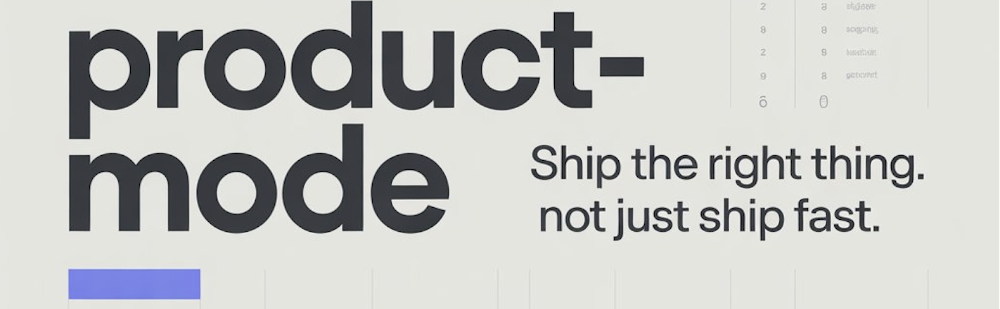

# product-mode



**Give your coding agent product judgment before it starts building.**

Free, MIT-licensed instructions for framing the problem, cutting scope, naming tradeoffs, and defining success. A drop-in `CLAUDE.md` / `AGENTS.md` for Claude Code, Cursor, Codex, and any coding agent that reads one. The CLI is optional.

The PM-team counterpart to [andrej-karpathy-skills](https://github.com/forrestchang/andrej-karpathy-skills). Credit to [@karpathy](https://x.com/karpathy) for naming the failure modes that inspired this work.

## Recent improvements

- **Questions that move the work forward:** inspect existing context first, ask about material decisions, and match unknowns to evidence, a decision, a prototype, or an experiment. Continue authorized, reversible work once the next useful step is clear.
- **More conservative CLI advice:** only small edits to existing ordinary documentation can automatically qualify as trivial. Code and agent instructions require review; failed commands return a nonzero status, and interactive commands explain when a terminal is required.
- **Checks you can inspect:** [six authored evaluation cases](./examples/uncertainty.md) for the product guidance, plus [CI](./.github/workflows/ci.yml) covering lint, instruction-file consistency, and CLI/package tests on Node 20.19, 22, and 24. The cases are prompts for comparison, not measured evidence of better agent decisions.

The updated instruction files are available now through the quick start below. The CLI fixes are merged on GitHub; see [CLI release availability](#installation) before installing from npm.

---

## Quick start: add the instructions

No npm install is needed for the instruction files.

**If you already have a `CLAUDE.md` or `AGENTS.md`:** open [CLAUDE.md](./CLAUDE.md) or [AGENTS.md](./AGENTS.md), copy the guidelines you need into your existing file, and resolve any conflicting instructions. Keep your project context and coding conventions. Commit or back up your current file before editing.

**For a project without `CLAUDE.md`:** run this from the project root. It refuses to overwrite an existing file.

```bash
if [ -e CLAUDE.md ]; then
  echo "CLAUDE.md already exists. Merge the guidelines into it instead."
else
  curl -fL https://raw.githubusercontent.com/sohaibt/product-mode/main/CLAUDE.md -o CLAUDE.md
fi
```

For an agent that reads `AGENTS.md`, use the same command with both occurrences of `CLAUDE.md` changed to `AGENTS.md`. Check your agent's instructions for supported file names and locations.

Start a fresh agent session and try:

> Add a dashboard to our SaaS app. Before coding, help me frame the problem, surface unknowns, choose the smallest useful scope, and define how we'll know it worked.

Look for an explicit user and problem, visible assumptions, a limited first step, a success measure, and a reversibility check. Supply missing evidence; the file cannot know your users or business on its own.

Already have project instructions? Follow the [step-by-step merge guide](./guides/add-to-existing-instructions.md) to preserve conventions, resolve conflicts, and test the result.

## See the thinking in practice

These are **illustrative worked examples**, not model transcripts or measured performance claims.

| Request | What the example works through |
|---|---|
| [“Add a dashboard”](./examples/dashboard.md) | Clarify whose decision the dashboard supports before choosing charts. |
| [“Build a complete referral system”](./examples/referrals.md) | Separate testing referral demand from building rewards infrastructure. |
| [“Add an onboarding checklist”](./examples/onboarding.md) | Define activation and measurement before treating checklist completion as success. |

[Run your own comparison](./examples/README.md) using the same request in fresh sessions with and without the guidelines.

## Resolve uncertainty without getting stuck

Product-mode checks existing context before asking questions. It asks about decisions that change the work, groups independent questions, and waits for prerequisite answers before discussing dependent choices.

Different unknowns need different next steps: missing facts need evidence, product choices need a decision, UX questions may need a prototype, and outcome hypotheses need an experiment. Once the next useful step is clear, proceed with authorized, reversible work and record how remaining assumptions will be tested.

Use the [evaluation cases](./examples/uncertainty.md) to check whether your agent makes those distinctions, avoids invented evidence, and keeps routine work moving. These are authored cases, not measured results. Deeper product challenge sessions should be requested explicitly.

---

## The Two Problems

Karpathy named the problem for engineers working with LLMs:

> "The models make wrong assumptions on your behalf and just run along with them... They don't manage their confusion, don't seek clarifications, don't surface inconsistencies, don't present tradeoffs, don't push back when they should."

His CLAUDE.md fixes this for solo engineers. It's excellent.

But there's a failure mode it doesn't touch, the one that kills product teams:

> **Shipping the wrong thing, well.**

A beautifully implemented feature for a problem that doesn't matter is still waste. And in mixed PM + engineering teams working with Claude Code, that's the more expensive mistake.

**product-mode** adds the missing layer: problem framing, scope discipline, tradeoff articulation, outcome measurement, and decision logging, applied *before* the code gets written.

---

## The Seven Principles

| # | Principle | What it prevents |
|---|---|---|
| 1 | **Frame the Problem Before the Solution** | Building for the wrong user |
| 2 | **Make Assumptions & Unknowns Visible** | Silent guessing |
| 3 | **Ship the Minimum Viable Change** | Scope creep, gold-plating |
| 4 | **Name the Tradeoffs** | Invisible costs, political decisions |
| 5 | **Define Done by Outcome, Not Output** | "Merged" mistaken for "done" |
| 6 | **Instrument Before You Ship** | Shipping blind |
| 7 | **Log the Decision, Flag Reversibility** | Repeating mistakes, calcifying defaults |

Plus a **pre-flight checklist** (5 questions before any non-trivial change) and a **when-to-skip-this-rigor** table: because not every typo needs a decision log.

Full file: [`CLAUDE.md`](./CLAUDE.md). Same file, other name: [`AGENTS.md`](./AGENTS.md).

---

## Optional CLI: save checklists and decisions

The instruction files work on their own. The CLI provides interactive commands that save checklists and decision logs in your project.

### Installation

**Release availability:** npm currently serves `1.0.2`. The CLI fixes from [PR #4](https://github.com/sohaibt/product-mode/pull/4) are merged on GitHub `main` and await a new npm release. The CLI behavior documented below describes `main`; `npx` and global installs will receive the fixes after that release. The quick-start downloads of `CLAUDE.md` and `AGENTS.md` already include the updated guidance.

```bash
# Run without installing
npx product-mode init

# Or install it globally
npm install -g product-mode
```

Requires Node.js 20.19 or newer.

### Usage

#### Initialize (once per project)
```bash
product-mode init
```

Creates `.product-mode/checklist/` and `.product-mode/decisions/`, and appends a "Prior Decisions & Checklists" section to your `CLAUDE.md` / `AGENTS.md` (if present) so agents read existing decisions before starting non-trivial work. Safe to re-run.

`init` sets up artifact storage and references. Add the product guidelines separately using the quick start above.

#### Pre-flight Checklist
Run before starting any non-trivial work:

```bash
product-mode checklist
# Or with work description
product-mode checklist "Add user profile feature"
```

This will prompt you through the 5-question pre-flight checklist and save your answers to `.product-mode/checklist/`.

#### Decision Logging
Log important decisions following Principle #7:

```bash
product-mode decision
# Or with title
product-mode decision "Choose database technology"
```

Creates a structured decision log in `.product-mode/decisions/`.

#### Trivial Change Detection
Check if your changes are trivial (can skip full rigor):

```bash
product-mode trivial
# Or check specific files
product-mode trivial src/app.js src/utils.js
```

Only small edits to existing ordinary documentation (`.md`, `.txt`, `.rst`, `.adoc`; at most 10 added/deleted lines across the diff) can qualify for lighter rigor. Code, executable Markdown (`.mdx`), agent instructions, sensitive files, new/deleted files, renames, mode changes, binary files, and unsupported diffs require review. Even a short string edit or whitespace change can alter behavior.

Checks staged changes first, or unstaged changes if no matching changes are staged. Explicit file paths use the same rule. Untracked files are not included. The result is advisory: use the guidelines' change-type table to choose the appropriate rigor. A small bug fix can use Principles 2, 3, 5; new features and costly commitments need the full checklist.

`checklist` and `decision` require an interactive terminal. Agents can write Markdown entries directly in the same folders. Command failures exit with a nonzero status; a successful `trivial` assessment exits with zero for either recommendation.

### Example Workflow

```bash
# 1. Think about starting work
product-mode checklist "Implement dark mode toggle"
# → Answers questions and saves checklist

# 2. Do the work
# ... write code ...

# 3. Check if changes are trivial before committing
product-mode trivial
# → If non-trivial, consider running checklist again
# → If trivial, you can proceed with lighter rigor

# 4. Log important decisions
product-mode decision "Dark mode implementation approach"
# → Logs your choice of CSS variables vs separate stylesheet, etc.
```

---

## Who This Is For

- **PMs who vibe-code** with Claude Code, Cursor, or Lovable and want their AI to think like a product partner
- **Engineering teams** working alongside product, tired of re-shipping because the problem was wrong
- **Solo founders** building SaaS who want guardrails against their own scope creep

If you're shipping with AI and your bottleneck is *what to build*, not *how to build it*, this is for you.

---

## Why This Exists

I've spent 20+ years in product leadership (Booking.com, Foodics, Eneco, Tamatem Games). I am now building products, one specifically to help solve the problem of not building the right thing (not announced yet) and write about Product Management and AI-assisted product building at [Mastering Product HQ](https://masteringproducthq.substack.com).

Every week I see the same pattern: teams using Claude Code to ship faster, and shipping the wrong thing faster. Karpathy nailed the engineering half. This file tries to nail the product half.

From Karpathy: *"LLMs are exceptionally good at looping until they meet specific goals… Don't tell it what to do, give it success criteria and watch it go."*

From product: *the hardest bug to fix is shipping the wrong thing, well.*

---

## How to Know It's Working

- Fewer rebuilds because "we shipped the wrong thing."
- Assumptions get challenged *before* code, not in review.
- Tradeoffs appear in writing, not just in Slack threads.
- Every shipped feature has a metric attached, checked on a date.
- The decision log is the first thing new teammates read - and it's useful.

---

## Customization

These principles are meant to be merged with your project's own CLAUDE.md. Add project-specific context below the seven principles:

```markdown
## Project-Specific Context

- Our primary user is [X]
- Success metric for this quarter is [Y]
- We intentionally avoid [Z]
```

---

## Tradeoff Note

These guidelines scale review to the cost of being wrong. Routine fixes can proceed with lighter rigor; new features and costly commitments need more evidence and explicit tradeoffs. Use the file's *when to skip this rigor* table, and stop questioning once the next authorized, useful step is clear.

The uncertainty guidance draws on Matt Pocock's [grill-me / grilling skills](https://github.com/mattpocock/skills) and [explanation of when to prototype](https://www.aihero.dev/skills-grill-me), adapted for product evidence, scope, and outcome validation.

---

## More From the Same Author

product-mode is the *thinking* layer. These are the *doing* layers:

| Tool | What it does |
|---|---|
| [strategy-mcp](https://github.com/sohaibt/strategy-mcp) | MCP server that gives Claude 12 product strategy frameworks as tools (RICE, JTBD, assumption mapping, TAM/SAM/SOM, Wardley) |
| [founder-mode](https://github.com/sohaibt/founder-mode) | Claude Code plugin that turns it into an AI co-founder: strategy review, competitor scan, stress-test, stakeholder updates |
| [agent-pm](https://github.com/sohaibt/agent-pm) | Claude Code plugin with 12 commands for building AI agent products, from "should this even be an agent?" to production readiness |

---

## License

MIT. Fork, adapt, make it your team's own. If it helps, a star is appreciated.

---

*Inspired by [andrej-karpathy-skills](https://github.com/forrestchang/andrej-karpathy-skills) and [Andrej Karpathy's observations](https://x.com/karpathy/status/2015883857489522876) on LLM coding pitfalls.*
